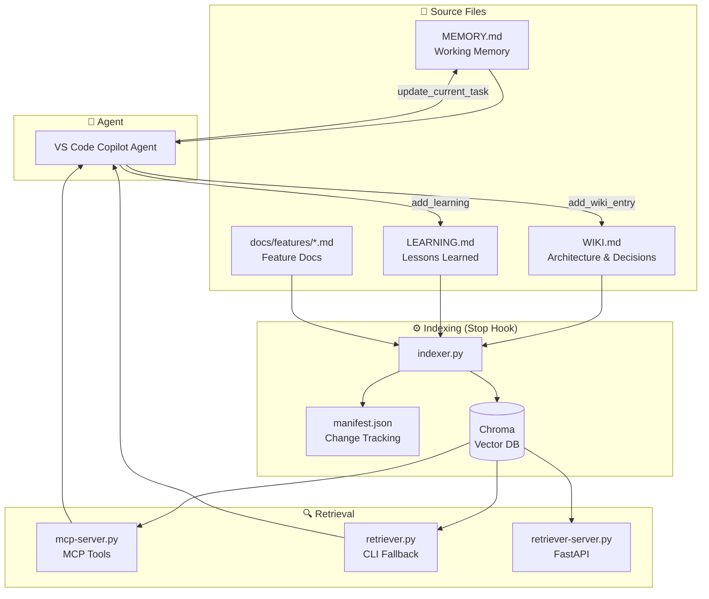

# Project Memory — Vector DB Skill

A **semantic long-term memory system** for AI coding agents. Instead of the agent reading entire documentation files or relying on keyword search, this skill uses **vector search (RAG)** to retrieve only the most relevant knowledge chunks — minimizing token usage and maximizing accuracy.

Built for **VS Code Copilot** with MCP (Model Context Protocol) native tool integration.

## Architecture



## How It Works

| Phase | Component | Description |
|-------|-----------|-------------|
| **Index** | `indexer.py` | Scans docs/ → recursive size-aware chunking → embeds via `BAAI/bge-m3` → stores in Chroma |
| **Retrieve** | MCP tools / CLI | Semantic search returns relevant chunks with file paths and line numbers |
| **Write** | MCP tools | Granular tools to update MEMORY.md, WIKI.md, LEARNING.md without overwriting |
| **Sync** | `refresh_index()` | Rebuilds Chroma index after documentation changes |

## Installation

### 1. Install dependencies

```bash
pip install chromadb sentence-transformers mcp[cli]
```

- **chromadb** — Embedded vector database (no server, on-disk)
- **sentence-transformers** — Local embedding model (`BAAI/bge-m3`, 1.1GB, 1024-dim, multilingual, 8K context)
- **mcp[cli]** — MCP Python SDK for native VS Code agent tools

### 2. Bootstrap the skill

```bash
# From repo root:
python .github/skills/project-memory-vector-db/scripts/init.py
```

This creates:
```
project-memory-vector-db/
├── MEMORY.md              ← Working memory (edit this)
├── docs/
│   ├── WIKI.md            ← Architecture & decisions
│   ├── LEARNING.md        ← Lessons learned
│   └── features/          ← Feature docs (add .md files here)
├── manifest.json          ← Change tracking (auto-generated)
└── vector-db/             ← Chroma storage (auto-managed, gitignore)
```

### 3. Merge agent rules

Copy the contents of `project-memory-vector-db/docs/AGENTS.md` into your root `AGENTS.md` or `.github/copilot-instructions.md`.

### 4. Build the vector index

```bash
python .github/skills/project-memory-vector-db/scripts/indexer.py
```

The indexer reads all markdown files in `docs/`, applies recursive size-aware chunking (headings → paragraphs → sentences → hard split, 768 tokens max, ~128 token overlap), generates embeddings via `BAAI/bge-m3`, and stores them in Chroma.

### 5. Restart VS Code

VS Code will detect the MCP server configuration and start it on demand.

## Usage

### MCP Tools (Recommended)

Once installed, the VS Code agent has access to these tools natively:

| Tool | When to use |
|------|-------------|
| `search_memory("How does payment retry work?")` | Find relevant knowledge |
| `get_memory()` | Check current working memory |
| `update_current_task("Implementing JWT auth")` | Update what you're working on |
| `append_memory_note("Found a bug in...")` | Save a quick note |
| `add_learning("JWT Fix", ...)` | Document a bug fix |
| `add_wiki_entry("Auth Flow", ...)` | Add new entry (skips if duplicate) |
| `update_wiki_entry("Auth Flow", ..., "Section")` | Replace existing entry content |
| `expand_wiki_entry("Auth Flow", ..., "Section")` | Append to existing entry |
| `remove_wiki_entry("Auth Flow", "Section")` | Delete an entry |
| `refresh_index()` | Sync index after doc edits |
| `index_status()` | Check vector DB health |

### CLI Fallback (if MCP is unavailable)

```bash
# Direct mode (loads model per query ~1-2s)
python .github/skills/project-memory-vector-db/scripts/retriever.py \
  --query "How does payment retry work?" --top-k 5

# Server mode (keeps model warm, ~50ms)
python .github/skills/project-memory-vector-db/scripts/retriever-server.py --port 8000
python .github/skills/project-memory-vector-db/scripts/retriever.py \
  --server --query "How does payment retry work?" --top-k 5
```

## MCP Server Lifecycle

The MCP server is a **long-running process** managed by VS Code. It loads all Python code into memory at startup and does **not** automatically reload when source files change.

### When to restart

| Scenario | Why restart is needed | Action |
|----------|----------------------|--------|
| **Code changes** — editing `memory.py`, `mcp-server.py`, `retriever_lib.py`, or any `.py` file under `scripts/` | The server imported the old bytecode; edits won't take effect until the process restarts | Reload Window (`Ctrl+Shift+P` → `Developer: Reload Window`) |
| **WIKI.md/LEARNING.md edits made outside MCP tools** — manually editing `docs/` files with an external editor or direct `replace_string_in_file` | The MCP server reads/writes files via the filesystem, so manual edits are visible immediately. **No restart needed.** | Just run `refresh_index()` to sync the vector index |
| **New feature docs added** — creating `docs/features/*.md` files manually | No restart needed — only the vector index needs rebuilding | Run `refresh_index()` |
| **Chroma DB corrupted or out of sync** | The index is stale; fresh embedding is needed | Run `refresh_index()` |

### How to restart

**Option 1 — Reload Window** (recommended, full clean restart):
```bash
Ctrl+Shift+P → Developer: Reload Window
```

**Option 2 — Kill and restart the MCP process** (faster, no UI reload):
```bash
Ctrl+Shift+P → Developer: Restart Extension Host
```

> **💡 Tip:** After restarting, always run `refresh_index()` to rebuild the vector index and confirm the MCP server is responding.

### ⚠️ Inspector vs Real MCP server

The **MCP Inspector** (`npx @modelcontextprotocol/inspector ...`) is a **debugging/development tool only**. Important differences:

| Aspect | VS Code's MCP server | Inspector |
|--------|---------------------|-----------|
| **Process** | Long-running, managed by VS Code | Spawns a **new, independent** process each time |
| **Chroma connection** | Persistent, shares `collection` global across tool calls | Fresh connection — `init_model()` may not load the model in time before first tool call |
| **`refresh_index()`** | Reuses the existing `collection` object → data preserved | If called before model loads, `collection` is `None` → creates a fresh empty collection |
| **`search_memory()`** | Works against the real indexed data | Only sees what was indexed in THAT inspector session |

**Caveat:** Calling `refresh_index()` from the inspector before the model has fully loaded can create an **empty collection** that shadows the real one. If you accidentally do this, run `refresh_index()` from the **real** VS Code agent to restore the index.

**Use the inspector for:**
- Verifying tool signatures (parameter names, types, descriptions)
- Checking response formats
- Debugging tool errors

**Do NOT use the inspector for:**
- Trusting index counts or search results
- Permanent state changes

## Chunking Strategy

The `indexer.py` uses a **recursive, size-aware chunking strategy** optimized for RAG retrieval:

| Step | Boundary | Why |
|:-----|:---------|:----|
| **1. Primary** | `##` / `###` headings | Respects semantic document structure — each section is a logical unit |
| **2. Paragraph** | `\n\n` (blank lines) | If a section exceeds 768 tokens, split between paragraphs first |
| **3. Line** | `\n` | If paragraph groups are still too big, split at individual line breaks |
| **4. Sentence** | `.`, `!`, `?` boundaries | If lines don't break cleanly, split at natural sentence endings |
| **5. Hard split** | Character count (last resort) | Ensures no chunk ever exceeds the token limit |

### Parameters

| Parameter | Value | Effect |
|:----------|:------|:-------|
| **`MAX_TOKENS`** | **768** | Target max tokens per chunk. Fits well within BGE-M3's 8192 limit while keeping chunks focused |
| **`OVERLAP_CHARS`** | **512** (~128 tokens) | ~17% overlap between consecutive sub-chunks prevents context loss at boundaries |
| **Token estimation** | `len(text) // 4` | Rough ~4 chars/token for English — no tokenizer dependency needed |

### Overlap behavior

When a section is split into multiple chunks, each subsequent chunk **prepends the tail of the previous chunk**:

```
[Section A content ...] ──→ Chunk 1
[tail of A][Section B content ...] ──→ Chunk 2
[tail of B][Section C content ...] ──→ Chunk 3
```

This ensures retrieval queries that span a chunk boundary still find relevant results.

### Why this works well for RAG

- **Semantic first**: Headings create the primary boundaries, so chunks align with topics
- **Graceful fallback**: No chunk exceeds 768 tokens even if the source has no natural breaks
- **Context continuity**: Overlap prevents boundary information loss
- **Metadata preserved**: Each chunk retains its file path, heading hierarchy, and approximate line range

## File Structure

```
project-memory-vector-db/
├── MEMORY.md                    ← Working memory (loaded every session)
├── docs/                        ← Human source of truth
│   ├── WIKI.md                  ← Architecture, decisions, standards
│   ├── LEARNING.md              ← Lessons learned, bug fixes
│   └── features/                ← Feature docs (add any .md files)
├── vector-db/                   ← Chroma storage (auto-managed)
├── manifest.json                ← Change tracking (auto-generated)
└── .github/
    └── skills/
        └── project-memory-vector-db/
            ├── SKILL.md         ← Skill documentation
            ├── plan.md          ← Architecture plan
            └── scripts/
                ├── init.py              ← Bootstrap
                ├── session_start.py     ← SessionStart hook
                ├── indexer.py           ← Build vector index
                ├── mcp-server.py        ← MCP server (9 tools)
                ├── memory.py            ← File operations
                ├── retriever.py         ← CLI retriever
                ├── retriever-server.py  ← FastAPI server
                ├── retriever_lib.py     ← Shared utilities
                └── templates/           ← Starter templates
```

## Testing the MCP Server

```bash
npx @modelcontextprotocol/inspector python .github/skills/project-memory-vector-db/scripts/mcp-server.py
```

## Architecture Evolution

| Phase | Component | Status |
|-------|-----------|--------|
| **1** | `retriever.py` CLI (model per query) | ✅ Stable |
| **2** | `retriever-server.py` FastAPI (warm model) | ✅ Stable |
| **3** | `mcp-server.py` MCP tools (native) | ✅ Current |
