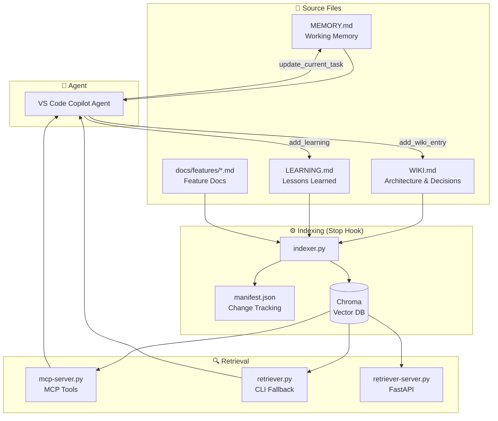

# Project Memory — Vector DB Skill

A **semantic long-term memory system** for AI coding agents. Instead of the agent reading entire documentation files or relying on keyword search, this skill uses **vector search (RAG)** to retrieve only the most relevant knowledge chunks — minimizing token usage and maximizing accuracy.

Built for **VS Code Copilot** with MCP (Model Context Protocol) native tool integration.

## Architecture



## How It Works

| Phase | Component | Description |
|-------|-----------|-------------|
| **Index** | `indexer.py` | Scans docs/ → chunks by H2/H3 headings → embeds via `all-MiniLM-L6-v2` → stores in Chroma |
| **Retrieve** | MCP tools / CLI | Semantic search returns relevant chunks with file paths and line numbers |
| **Write** | MCP tools | Granular tools to update MEMORY.md, WIKI.md, LEARNING.md without overwriting |
| **Sync** | `refresh_index()` | Rebuilds Chroma index after documentation changes |

## Installation

### 1. Install dependencies

```bash
pip install chromadb sentence-transformers mcp[cli]
```

- **chromadb** — Embedded vector database (no server, on-disk)
- **sentence-transformers** — Local embedding model (`all-MiniLM-L6-v2`, 80MB)
- **mcp[cli]** — MCP Python SDK for native VS Code agent tools

### 2. Bootstrap the skill

```bash
# From repo root:
python .github/skills/project-memory-vector-db/scripts/init.py
```

This creates:
```
project-memory-vector-db/
├── MEMORY.md              ← Working memory (edit this)
├── docs/
│   ├── WIKI.md            ← Architecture & decisions
│   ├── LEARNING.md        ← Lessons learned
│   └── features/          ← Feature docs (add .md files here)
├── manifest.json          ← Change tracking (auto-generated)
└── vector-db/             ← Chroma storage (auto-managed, gitignore)
```

### 3. Merge agent rules

Copy the contents of `project-memory-vector-db/docs/AGENTS.md` into your root `AGENTS.md` or `.github/copilot-instructions.md`.

### 4. Build the vector index

```bash
python .github/skills/project-memory-vector-db/scripts/indexer.py
```

The indexer reads all markdown files in `docs/`, chunks them by headings, generates embeddings, and stores them in Chroma.

### 5. Restart VS Code

VS Code will detect the MCP server configuration and start it on demand.

## Usage

### MCP Tools (Recommended)

Once installed, the VS Code agent has access to these tools natively:

| Tool | When to use |
|------|-------------|
| `search_memory("How does payment retry work?")` | Find relevant knowledge |
| `get_memory()` | Check current working memory |
| `update_current_task("Implementing JWT auth")` | Update what you're working on |
| `append_memory_note("Found a bug in...")` | Save a quick note |
| `add_learning("JWT Fix", ...)` | Document a bug fix |
| `add_wiki_entry("Auth Flow", ...)` | Record a decision |
| `refresh_index()` | Sync index after doc edits |
| `index_status()` | Check vector DB health |

### CLI Fallback (if MCP is unavailable)

```bash
# Direct mode (loads model per query ~1-2s)
python .github/skills/project-memory-vector-db/scripts/retriever.py \
  --query "How does payment retry work?" --top-k 5

# Server mode (keeps model warm, ~50ms)
python .github/skills/project-memory-vector-db/scripts/retriever-server.py --port 8000
python .github/skills/project-memory-vector-db/scripts/retriever.py \
  --server --query "How does payment retry work?" --top-k 5
```

## File Structure

```
project-memory-vector-db/
├── MEMORY.md                    ← Working memory (loaded every session)
├── docs/                        ← Human source of truth
│   ├── WIKI.md                  ← Architecture, decisions, standards
│   ├── LEARNING.md              ← Lessons learned, bug fixes
│   └── features/                ← Feature docs (add any .md files)
├── vector-db/                   ← Chroma storage (auto-managed)
├── manifest.json                ← Change tracking (auto-generated)
└── .github/
    └── skills/
        └── project-memory-vector-db/
            ├── SKILL.md         ← Skill documentation
            ├── plan.md          ← Architecture plan
            └── scripts/
                ├── init.py              ← Bootstrap
                ├── session_start.py     ← SessionStart hook
                ├── indexer.py           ← Build vector index
                ├── mcp-server.py        ← MCP server (9 tools)
                ├── memory.py            ← File operations
                ├── retriever.py         ← CLI retriever
                ├── retriever-server.py  ← FastAPI server
                ├── retriever_lib.py     ← Shared utilities
                └── templates/           ← Starter templates
```

## Testing the MCP Server

```bash
npx @modelcontextprotocol/inspector python .github/skills/project-memory-vector-db/scripts/mcp-server.py
```

## Architecture Evolution

| Phase | Component | Status |
|-------|-----------|--------|
| **1** | `retriever.py` CLI (model per query) | ✅ Stable |
| **2** | `retriever-server.py` FastAPI (warm model) | ✅ Stable |
| **3** | `mcp-server.py` MCP tools (native) | ✅ Current |
